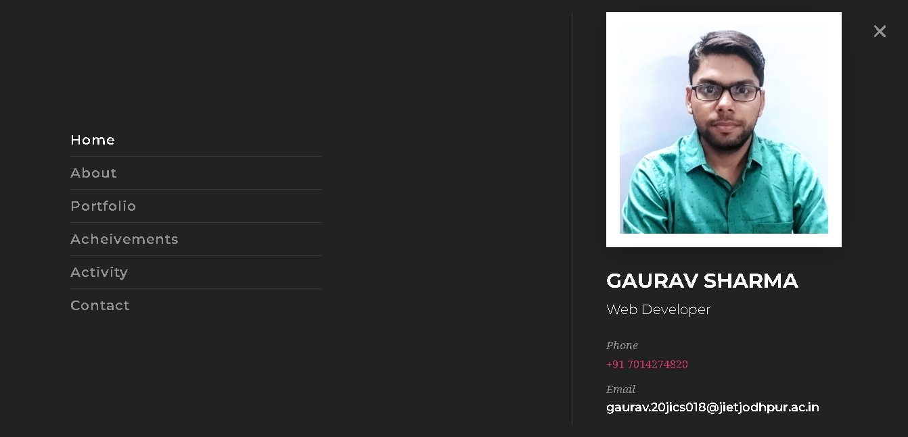

  

<h1 align="center">
  Gaurav Sharma
</h1>

<h3 align="center">
  Web Developer
</h3>

  

### WordPress Portfolio Website (Multiple Pages)

This is my Personal Portfolio Website built using WordPress and the Arrival Me template. It highlights my professional background, skills, portfolio projects, and contact details. Designed with a modern aesthetic and user-friendly layout, it's ideal for showcasing my online presence.

### Technology Stack
- WordPress
- Flo Theme – (https://themeforest.net/item/flo-creative-portfolio-resume-template-kit/26423130?srsltid=AfmBOoqbpwLUbNFDqmGrKJFmzh9-daxuQpuknRKsfS2MW1Qqg4wnZ4Vp)
- Elementor Pro, WPForms etc. plugins
- MySQL DataBase

 

### Features
- 🎨 Minimal, clean, and creative layout
- 📱 Fully responsive and mobile-friendly
- 🖼️ Portfolio section with image galleries or project details
- 📄 Custom About, Resume, and Contact pages
- ⚡ Fast-loading and SEO-optimized
- 🧩 Easy to extend with plugins and widgets

 

### Setup Instructions 
1. setup wordpress and its database
2. import/install plugin, all-in-one wpmigration unlimited extention
3. import the project (.wpress) file through all-in-one wpmigration

 

### Credintials
userename: admin  
password: gaurav116  

 

### Sample Snapshots

Homepage:
     

About Page: 
     

Portfolio:
     

Acheivements:
     

Activity/Blog: 
     

Contact:
     

Menu:
     

Search:
     

 

### Developer

Gaurav Sharma  
gaurav110601@gmail.com  
> [LinkedIn](https://www.linkedin.com/in/gaurav110601/)
<!-- ................................................................................................................................. -->
